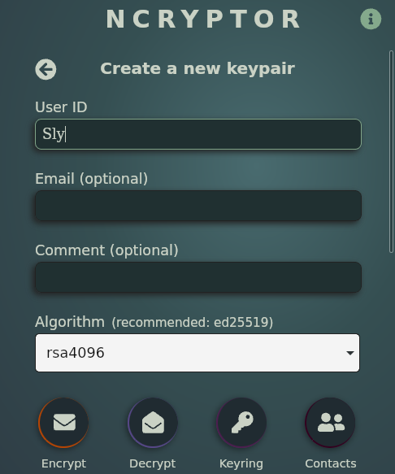

# Ncryptor Desktop

Use public-key cryptography to send private messages over *any* application.


Ncryptor Desktop is a simple, cross-platform program used to invoke the [GNU Privacy Guard](https://gnupg.org/). It uses [PGP](https://en.wikipedia.org/wiki/Pretty_Good_Privacy) to encrypt plain text messages that can be safely sent over any messaging platform.

## How it works

Let's say *Sly* wants to send *Bentley* an address to meet at.

1. They both download and run *Ncryptor* on their own machines, as well as their favorite unsecure messaging platform — say, [Discord](https://discordapp.com/).
2. They each generate a short-lived RSA keypair from the Keyring view.



3. Each RSA keypair has a **private key** (or **secret key**) and a **public key**. Sly and Bentley send each other their public keys over Discord.
4. They import each other's public keys from the Contacts view.


5. Sly types the address into the Encrypt view . . .


6. . . . and clicks "Encrypt" to encrypt the text so that only Bentley's private key can decrypt it.


7. Sly sends the encrypted text to Bentley over Discord, who then pastes the text into his *Ncryptor*.


8. Bentley clicks "Decrypt" to view the secret message securely.


They can each repeat steps 5-8 each time they want to send a private message over the Internet.

## Features

- Encrypt plain text messages or text files to anyone in your contacts
- Decrypt messages encrypted just for you
- Browse the PGP keys in your keyring and contacts
- Generate new RSA keypairs for encryption (ED25519 coming soon)
- Easily import public PGP keys into your contacts
- Delete keys (with clear confirmation required)

## Compatibility

Ncryptor Desktop runs on the following 64-bit operating systems using [Tauri](https://tauri.app/):

- Linux (.deb, .rpm, or .AppImage)
- Windows (at least version 8, .msi or .exe)
- macOS (.app or .dmg)*

*requires building

### Downloads

### Debian-Based (Ubuntu, Mint, etc.)
Download the `.deb` file on the [Releases](https://github.com/jtdemey/ncryptor-desktop/releases) page and install it like:
```
sudo dpkg -i ~/path/to/ncryptor-x.x.x_amd64.deb
```

### RHEL and Fedora
Download the `.rpm` file on the [Releases](https://github.com/jtdemey/ncryptor-desktop/releases) page and install it like:
```
sudo dnf install ~/path/to/ncryptor-x.x.x_amd64.rpm
```

### Windows
Download and run the `.msi` or `.exe` installer on the [Releases](https://github.com/jtdemey/ncryptor-desktop/releases) page and install it like:

## Requirements

- [GNU Privacy Guard (gpg)](https://www.gnupg.org/index.html) >= v2.3.4

## Security

Ncryptor Desktop is an open-source React frontend that uses [Tauri](https://tauri.app/) to run as a native application outside of the browser. Aside from anything that may be included in Tauri's infrastructure, it doesn't have any telemetry nor does it make any HTTP requests. Tauri uses [Microsoft Edge WebViews](https://developer.microsoft.com/en-us/microsoft-edge/webview2/#download-section).
